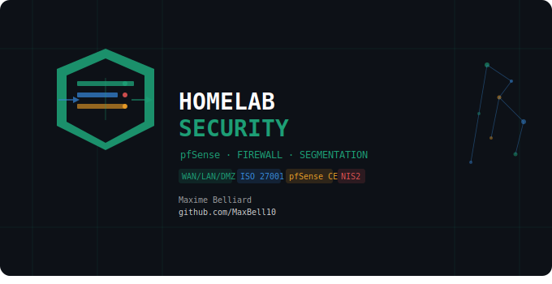

# 🔥 pfSense Network Segmentation Lab

> Home lab implementing network segmentation with pfSense CE, firewall rules, and hardening — built as a portfolio project for GRC + Technical security roles in Belgium.

---

## 📋 Overview

This lab demonstrates the design and implementation of a segmented network using pfSense CE as a firewall/router between three isolated zones: WAN, LAN, and DMZ. All components run as virtual machines in VirtualBox on a single host machine.

---

## 🎯 Project Objective

This lab simulates real-world network security challenges faced by network engineers, security engineers, and GRC professionals:

- Segmenting a corporate network into isolated security zones
- Enforcing least-privilege traffic flows between zones using explicit firewall rules
- Hardening the firewall appliance itself (TLS, port change, disabled services)
- Capturing and analysing inter-zone traffic with tcpdump and Wireshark
- Mapping the architecture to NIS2 and ISO 27001 controls

It reflects the intersection of network engineering and security governance — directly aligned with internal GRC + Technical roles in Belgium.

---

## 🏗️ Architecture

```
                    [WAN — NAT / simulated internet]
                             10.0.2.15
                                 |
                           [pfSense CE]
                          192.168.1.1 | 192.168.2.1
                           /                  \
                        [LAN]               [DMZ]
                    192.168.1.x          192.168.2.x
                  (AD, workstations)   (fictional web server)
```

| VM | Role | IP | OS |
|---|---|---|---|
| pfSense | Firewall / Router | WAN: 10.0.2.15 / LAN: 192.168.1.1 / DMZ: 192.168.2.1 | pfSense CE 2.7.2 |
| Windows Server 2022 | Domain Controller (LAN) | 192.168.1.x (DHCP) | Windows Server 2022 Datacenter Eval |
| Windows 10 Pro | Client workstation (LAN) | 192.168.1.x (DHCP) | Windows 10 Pro |
| Fictional web server | DMZ target | 192.168.2.x (DHCP) | — |

### VirtualBox Network Interfaces

| Interface | pfSense NIC | VirtualBox Mode | Subnet |
|---|---|---|---|
| WAN | em0 | NAT | 10.0.2.x |
| LAN | em1 | Internal Network `lan-network` | 192.168.1.0/24 |
| DMZ | em2 | Internal Network `dmz-network` | 192.168.2.0/24 |

### DHCP Ranges

| Zone | Range |
|---|---|
| LAN | 192.168.1.10 — 192.168.1.245 |
| DMZ | 192.168.2.100 — 192.168.2.150 |

---

## 🔒 Security Controls Implemented

### Firewall Rules

| Rule | Interface | Protocol | Source | Destination | Port | Action |
|---|---|---|---|---|---|---|
| WAN → DMZ | WAN | TCP | Any | DMZ | 443 | ✅ Pass |
| LAN → WAN | LAN | TCP | LAN | Any | 80, 443 | ✅ Pass |
| LAN → DMZ | LAN | TCP | LAN | DMZ | 80, 443 | ✅ Pass |
| DMZ → LAN | DMZ | Any | DMZ | LAN | Any | 🚫 Block |
| WAN → LAN | (implicit) | Any | Any | LAN | Any | 🚫 Block |

> **Design principle:** Default-deny between all zones. Only explicitly permitted traffic flows are allowed. The DMZ → LAN block rule is the critical isolation control — a compromised DMZ host cannot reach internal resources.

### pfSense Hardening

| Control | Configuration | Justification |
|---|---|---|
| WebGUI port | Changed from 443 → **8443** | Reduces exposure to automated scanning on default ports |
| TLS certificate | Internal CA `Lab-CA` (RSA 2048, SHA-256) → cert `pfSense-WebGUI` | Eliminates self-signed warning; establishes internal PKI |
| UPnP | **Disabled** | Prevents unauthorised port forwarding by devices on LAN |
| SSH | **Disabled** | Reduces attack surface; management via WebGUI only |
| NAT reflection | **Disabled** | Prevents hairpin NAT abuse |

### Internal PKI

| Asset | Details |
|---|---|
| CA | `Lab-CA` — RSA 2048, SHA-256, 10-year validity (3650 days), `ST=Belgium, O=Lab, L=Brussels, CN=lab-ca, C=BE` |
| Certificate | `pfSense-WebGUI` — RSA 2048, SHA-256, 397 days, `ST=Belgium, O=Lab, L=Brussels, CN=192.168.1.1, C=BE`, signed by `Lab-CA` |

---

## 📡 Traffic Analysis — tcpdump & Wireshark

To validate that firewall rules enforce the intended traffic flows, packet captures were performed directly from the pfSense shell.

**Capture LAN → DMZ traffic (100 packets, HTTP/HTTPS only):**

```bash
tcpdump -i em1 -n -c 100 port 80 or port 443 -w /tmp/traffic.pcap
```

**Filter captured traffic to DMZ subnet only:**

```bash
tcpdump -r /tmp/traffic.pcap -nn | grep "192.168.2."
```

**Export capture to host for Wireshark analysis:**

```bash
scp admin@192.168.1.1:/tmp/traffic.pcap ./
```

Annotated Wireshark captures are available in the `/pcaps` directory. Each capture confirms that cross-zone traffic matches the firewall rule matrix above.

---

## 🖼️ Screenshots

All screenshots are located in the `/screenshots` directory.

### VirtualBox Setup

| File | Content |
|---|---|
| PF01-vbox-pfsense-adapter-wan-nat.png | VirtualBox — pfSense Adapter 1 → NAT (WAN) |
| PF02-vbox-pfsense-adapter-lan-network.png | VirtualBox — pfSense Adapter 2 → Internal Network `lan-network` (LAN) |
| PF03-vbox-pfsense-adapter-dmz-network.png | VirtualBox — pfSense Adapter 3 → Internal Network `dmz-network` (DMZ) |
| PF04-vbox-winsrv-adapter-lan-network.png | VirtualBox — Windows Server 2022 Adapter 1 → Internal Network `lan-network` |

### pfSense Initial Configuration

| File | Content |
|---|---|
| PF05-console-interfaces-wan-lan-dmz.png | pfSense console — WAN (em0) 10.0.2.15 / LAN (em1) 192.168.1.1 / OPT1 (em2) 192.168.2.1 |
| PF06-webgui-login-page.png | pfSense login page — `https://192.168.1.1` |
| PF07-wizard-welcome-step1.png | Setup Wizard — Welcome (Step 1/9) |
| PF08-wizard-timezone-brussels-step2.png | Setup Wizard — Time Server / Timezone: Europe/Brussels (Step 3/9) |
| PF09-wizard-lan-ip-step3.png | Setup Wizard — Configure LAN Interface: 192.168.1.1/24 (Step 5/9) |
| PF10-wizard-completed-step4.png | Setup Wizard — Wizard completed (Step 9/9) |
| PF11-dashboard-wan-lan-dmz-up.png | Dashboard — WAN/LAN/DMZ up, pfSense CE 2.7.2, CPU i7-14700HX |
| PF12-winsrv-ipconfig-lan-192-168-1-100.png | Windows Server 2022 — `ipconfig` showing IP 192.168.1.100 / gateway 192.168.1.1 |
| PF13-interface-dmz-config.png | Interfaces > OPT1 (DMZ) — Static IPv4 / 192.168.2.1/24 / interface enabled ✓ |

### Firewall Rules — Step-by-Step

| File | Content |
|---|---|
| PF14-firewall-rules-lan-default-rules.png | Firewall / Rules / LAN — default rules present (before hardening) |
| PF15-firewall-rules-lan-default-rules-deleted.png | Firewall / Rules / LAN — default rules deleted (before custom rules) |
| PF16-firewall-rule-edit-lan-to-wan.png | Edit rule — LAN to WAN: Pass / IPv4 TCP / LAN subnets → Any / port 80–443 |
| PF17-firewall-rule-edit-lan-to-dmz.png | Edit rule — LAN to DMZ: Pass / IPv4 TCP / LAN subnets → DMZ address / port 80–443 |
| PF18-firewall-rules-lan-final.png | Firewall / Rules / LAN — final state: 2 custom rules (LAN→WAN, LAN→DMZ) |
| PF19-firewall-rule-edit-dmz-to-lan-block.png | Edit rule — DMZ to LAN: **Block** / IPv4 Any / DMZ address → LAN subnets |
| PF20-firewall-rule-edit-wan-to-dmz-https.png | Edit rule — WAN to DMZ: Pass / IPv4 TCP / Any → DMZ subnets / port 443 |
| PF21-firewall-rules-dmz-block-all.png | Firewall / Rules / DMZ — final state: 1 block rule (DMZ→LAN BLOCK ALL ❌) |
| PF22-firewall-rules-wan-https-only.png | Firewall / Rules / WAN — final state: 1 rule (WAN→DMZ HTTPS only) |
| PF23-firewall-rules-wan-applied.png | Firewall / Rules / WAN — changes applied successfully ✅ |
| PF24-firewall-rules-dmz-applied.png | Firewall / Rules / DMZ — changes applied successfully ✅ |

### Hardening — Internal PKI

| File | Content |
|---|---|
| PF25-cert-authority-edit-lab-ca.png | Certificate Authorities / Edit — Lab-CA creation form (RSA 2048, sha256, 3650 days, C=BE) |
| PF26-cert-authority-lab-ca-listed.png | Certificate Authorities — Lab-CA listed, Internal ✓, valid until 15 Apr 2036 |
| PF27-cert-edit-pfsense-webgui.png | Certificates / Add — pfSense-WebGUI creation form (RSA 2048, sha256, 397 days, signed by Lab-CA) |
| PF28-cert-pfsense-webgui-listed.png | Certificates — pfSense-WebGUI listed, Issuer: Lab-CA, valid until 20 May 2027 |

### Hardening — Admin Access & Services

| File | Content |
|---|---|
| PF29-system-advanced-port-8443-before-cert.png | System > Advanced > Admin Access — HTTPS, cert: GUI default, port: 8443 (before cert swap) |
| PF30-system-advanced-port-8443-cert-webgui.png | System > Advanced > Admin Access — HTTPS, cert: **pfSense-WebGUI**, port: **8443** (final state) |
| PF31-services-upnp-disabled.png | Services > UPnP & NAT-PMP — Enable UPnP unchecked (**disabled**) |
| PF32-system-advanced-ssh-disabled.png | System > Advanced > Admin Access — Secure Shell Server unchecked (**SSH disabled**) |

### Configuration Backup

| File | Content |
|---|---|
| PF33-diagnostics-backup-restore.png | Diagnostics > Backup & Restore — XML export (accessed via port 8443) |
| PF34-config-xml-exported.png | Windows Explorer — `config-pfSense.home.arpa-*.xml` exported (23 KB) |

### Validation — DHCP & Firewall Logs

| File | Content |
|---|---|
| PF35-dhcp-leases.png | Status > DHCP Leases — Windows Server (192.168.1.100) active lease confirmed ✅ |
| PF36-firewall-logs.png | Status > System Logs > Firewall — active block entries, default deny rule IPv4 ❌ |

---

## 🎯 What This Demonstrates

| Skill | Evidence |
|---|---|
| Network architecture & segmentation | 3-zone design (WAN/LAN/DMZ) with isolated subnets |
| Firewall rule design | Explicit least-privilege rules per zone pair, default-deny |
| Internal PKI | CA creation, certificate issuance and assignment |
| Firewall hardening | Port change, TLS, UPnP/SSH disabled |
| Traffic analysis | tcpdump captures, Wireshark annotation, rule validation |
| Configuration management | Anonymised config XML committed to repo (`config-anonymized.xml`) |
| Technical documentation | English-language README, hardening checklist, regulatory mapping |

---

## ⚖️ Regulatory Alignment

| Framework | Control |
|---|---|
| ISO 27001:2022 | A.8.20 Network security — network segmentation and access control |
| ISO 27001:2022 | A.8.21 Security of network services — secure configuration of network components |
| ISO 27001:2022 | A.8.22 Segregation of networks — DMZ isolation from internal LAN |
| NIS2 Art. 21 | Technical security measures — network segmentation, access control, monitoring |
| CIS Controls | Control 12 — Network Infrastructure Management |
| CIS Controls | Control 13 — Network Monitoring and Defense |

---

## 📚 Lessons Learned

See [`lessons_learned.md`](./lessons_learned.md) for a detailed account of challenges encountered and production differences.

Key takeaways:
- The default pfSense `allow LAN to any` rule must be explicitly deleted — leaving it in place defeats the entire segmentation model
- WebGUI port change (443 → 8443) requires updating the VirtualBox NAT port forwarding rule if accessing from the host; the session silently drops otherwise
- `tcpdump` on pfSense requires specifying the correct interface (`-i em1` for LAN, `-i em2` for DMZ) — capturing on `any` mixes all zone traffic and makes analysis harder
- In a production environment, the internal CA would be managed by a dedicated PKI service (e.g. Windows ADCS or HashiCorp Vault), not self-generated on the firewall

---

## 🗺️ Homelab Roadmap

This lab is part of a structured portfolio series demonstrating progressive cybersecurity skills across multiple domains:

| Area | Topic | Status |
|---|---|---|
| Identity & Access | Active Directory, GPO hardening, Wazuh SIEM | ✅ Complete |
| Network Security | pfSense, firewall rules, Suricata IDS/IPS | 🔄 In progress |
| GRC & Risk | EBIOS RM audit report, NIS2, IEC 62443 | 📋 Planned |
| Automation | Bash & PowerShell security scripts | 📋 Planned |
| Attack & Defense | Integrated AD + pfSense attack simulation | 📋 Planned |
| Networking | Cisco Packet Tracer, network design | 📋 Planned |
| Linux | Linux administration & hardening | 📋 Planned |

---

## 🛠️ Tools Used

- **VirtualBox** — Hypervisor
- **pfSense CE 2.7.2** — Open source firewall / router
- **Windows Server 2022** — Domain Controller on LAN segment (180-day eval)
- **Windows 10 Pro** — Client workstation on LAN segment
- **tcpdump** — Packet capture on pfSense interfaces
- **Wireshark** — Traffic analysis on exported captures

---

*All configurations are fictional and used solely for educational and portfolio purposes.*
